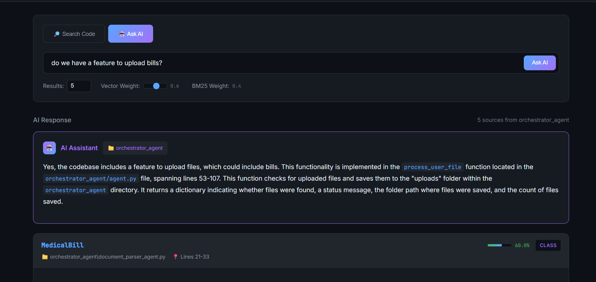
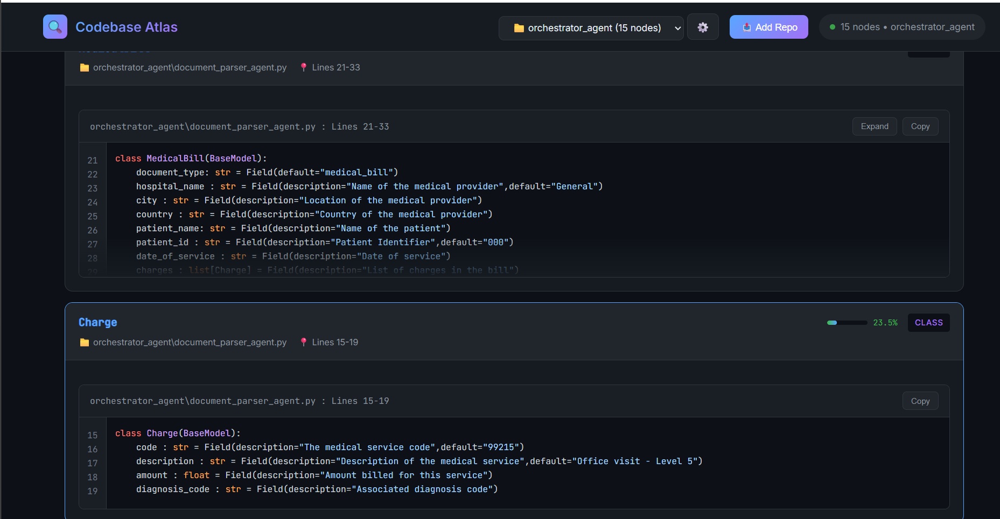
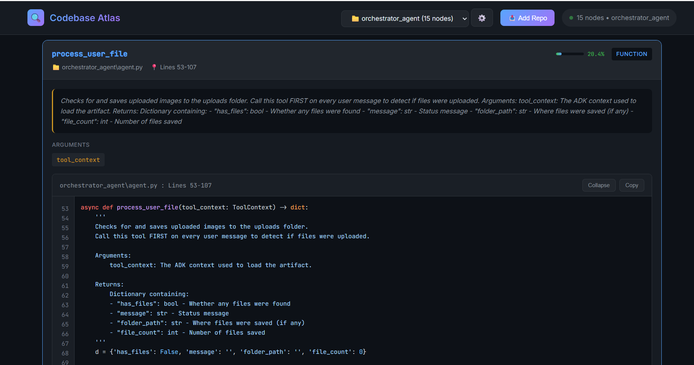
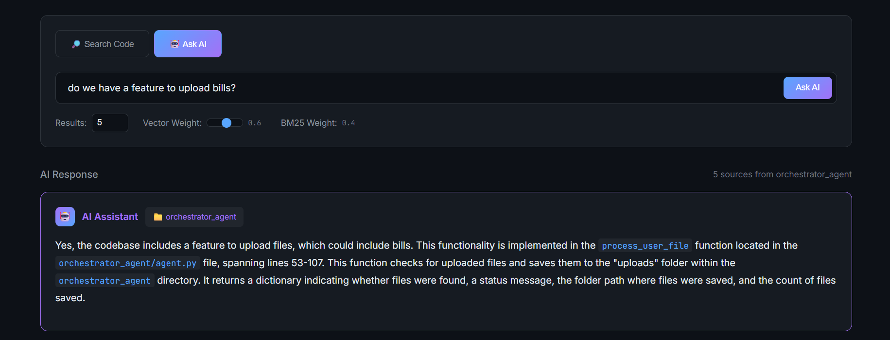

# 🔍 Codebase Atlas

**AI-powered semantic code search for Python repositories**

Codebase Atlas lets you search and ask questions about any Python codebase using hybrid search (vector + BM25) and AI-powered answers. Index repositories from GitHub or local folders and instantly search across functions, classes, and methods.


---

## 📸 Screenshots

### Search Code
Find functions, classes, and methods with hybrid semantic + keyword search:



### Ask AI
Get AI-powered answers about your codebase:



### Add Repository
Index repos from GitHub or upload local folders:



### Manage Repositories
View and delete indexed repositories:



---

## ✨ Features

- 🔗 **GitHub Integration** - Clone and index any public GitHub repository
- 📁 **Local Folder Upload** - Upload Python projects directly from your browser
- 🔎 **Hybrid Search** - Combines vector similarity (semantic) + BM25 (keyword) for best results
- 🤖 **AI Assistant** - Ask natural language questions about the codebase
- 📊 **Multi-Repository** - Index and switch between multiple codebases
- 💻 **Code Preview** - View source code with syntax highlighting and line numbers
- 🗑️ **Manage Repos** - Delete indexed repositories when no longer needed

---

## 🚀 Quick Start

### Prerequisites

- Python 3.10+
- Git (for GitHub cloning)
- OpenAI API key

### Installation

1. **Clone the repository**
   ```bash
   git clone https://github.com/yourusername/codebase-atlas.git
   cd codebase-atlas
   ```

2. **Create virtual environment**
   ```bash
   python -m venv .venv
   
   # Windows
   .venv\Scripts\activate
   
   # macOS/Linux
   source .venv/bin/activate
   ```

3. **Install dependencies**
   ```bash
   pip install -r requirement.txt
   ```

4. **Set up environment variables**
   ```bash
   # Create .env file
   echo "OPENAI_API_KEY=your-api-key-here" > .env
   ```

5. **Run the server**
   ```bash
   python api.py
   ```

6. **Open your browser**
   ```
   http://localhost:8000
   ```

---

## 📖 Usage

### Adding a Repository

#### From GitHub
1. Click **"Add Repo"** in the header
2. Select **"🔗 GitHub URL"** tab
3. Enter the repository URL (e.g., `https://github.com/owner/repo`)
4. Click **"Clone & Index"**

The repository will be cloned, parsed, and indexed. The cloned files are automatically deleted after indexing to save space.

#### From Local Folder
1. Click **"Add Repo"** in the header
2. Select **"📁 Local Folder"** tab
3. Choose a folder containing Python files
4. Click **"Upload & Index"**

### Searching Code

- **Search Mode**: Find functions, classes, and methods by name or description
- **Ask AI Mode**: Ask natural language questions like "How does authentication work?"

### Managing Repositories

- Use the dropdown to switch between indexed repos
- Click **⚙️** to open the Manage Repositories modal
- Delete repos you no longer need

---

## 🏗️ Architecture

```
┌─────────────────────────────────────────────────────────────┐
│                        Frontend                              │
│                    (static/index.html)                       │
└─────────────────────────────────────────────────────────────┘
                              │
                              ▼
┌─────────────────────────────────────────────────────────────┐
│                      FastAPI Server                          │
│                        (api.py)                              │
│  ┌─────────────┐  ┌─────────────┐  ┌─────────────────────┐  │
│  │   /search   │  │    /ask     │  │  /repos (CRUD)      │  │
│  └─────────────┘  └─────────────┘  └─────────────────────┘  │
└─────────────────────────────────────────────────────────────┘
                              │
          ┌───────────────────┼───────────────────┐
          ▼                   ▼                   ▼
┌──────────────────┐ ┌──────────────────┐ ┌──────────────────┐
│   repo_parser.py │ │  chroma_setup.py │ │    OpenAI API    │
│   (AST Parsing)  │ │ (Vector + BM25)  │ │   (Embeddings)   │
└──────────────────┘ └──────────────────┘ └──────────────────┘
                              │
                              ▼
                     ┌──────────────────┐
                     │    ChromaDB      │
                     │  (chroma_db/)    │
                     └──────────────────┘
```

---

## 📁 Project Structure

```
codebase-atlas/
├── api.py              # FastAPI server & endpoints
├── chroma_setup.py     # ChromaDB, embeddings, BM25, search logic
├── repo_parser.py      # Python AST parsing
├── static/
│   └── index.html      # Frontend (single-page app)
├── chroma_db/          # Vector database storage
├── uploaded_repos/     # Uploaded repository files
├── repo_index.json     # Repository metadata
├── requirement.txt     # Python dependencies
└── .env                # Environment variables (API keys)
```

---

## 🔧 API Endpoints

### Repositories

| Method | Endpoint | Description |
|--------|----------|-------------|
| `POST` | `/repos/github` | Clone & index a GitHub repository |
| `POST` | `/repos/upload` | Upload & index a local folder |
| `GET` | `/repos` | List all indexed repositories |
| `POST` | `/repos/{id}/activate` | Set active repository |
| `DELETE` | `/repos/{id}` | Delete a repository |

### Search

| Method | Endpoint | Description |
|--------|----------|-------------|
| `POST` | `/search` | Hybrid search (vector + BM25) |
| `POST` | `/ask` | AI-powered Q&A about the code |
| `GET` | `/search/vector` | Vector-only search |
| `GET` | `/search/bm25` | BM25-only search |

### Utilities

| Method | Endpoint | Description |
|--------|----------|-------------|
| `GET` | `/` | Frontend UI |
| `GET` | `/health` | Health check |
| `GET` | `/docs` | Swagger API documentation |

---

## ⚙️ Configuration

### Environment Variables

| Variable | Description | Required |
|----------|-------------|----------|
| `OPENAI_API_KEY` | OpenAI API key for embeddings | Yes |

### Search Parameters

| Parameter | Default | Description |
|-----------|---------|-------------|
| `top_n` | 5 | Number of results to return |
| `alpha` | 0.6 | Weight for vector search (0-1) |
| `beta` | 0.4 | Weight for BM25 search (0-1) |

---

## 🛠️ Tech Stack

- **Backend**: FastAPI, Uvicorn
- **Vector Store**: ChromaDB
- **Embeddings**: OpenAI `text-embedding-3-small`
- **Keyword Search**: BM25 (rank-bm25)
- **Parsing**: Python AST
- **Frontend**: Vanilla HTML/CSS/JS, Highlight.js

---

## 📝 How It Works

1. **Parsing**: Python files are parsed using the AST module to extract functions, classes, and methods with their metadata (name, docstrings, arguments, source code, line numbers)

2. **Embedding**: Each code node is converted to a rich text representation and embedded using OpenAI's embedding model

3. **Indexing**: Embeddings are stored in ChromaDB, and a BM25 index is created for keyword matching

4. **Search**: Queries use hybrid search combining semantic similarity (vector) and keyword matching (BM25) with configurable weights

5. **AI Answers**: For the "Ask AI" feature, relevant code is retrieved and sent to GPT-4 to generate contextual answers

---

## 🤝 Contributing

Contributions are welcome! Please feel free to submit a Pull Request.

---

## 📄 License

MIT License - feel free to use this project for any purpose.

---

## 🙏 Acknowledgments

- [ChromaDB](https://www.trychroma.com/) for the excellent vector database
- [OpenAI](https://openai.com/) for embeddings and language models
- [FastAPI](https://fastapi.tiangolo.com/) for the blazing-fast API framework
- [Highlight.js](https://highlightjs.org/) for syntax highlighting
